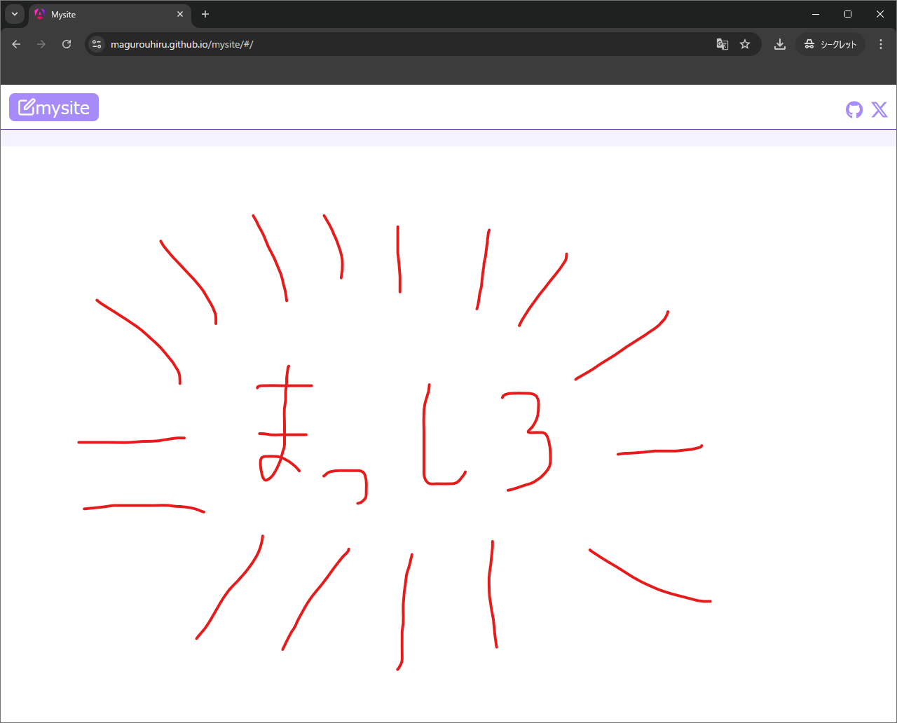

{"author":"magurouhiru","date":"2024/9/12","tags":["Git","GitHubActions"]}
# Git submodule とGitHub Actions を組み合わせて簡単に記事を公開できるようにするまで

## 前提
- GitHub Pages にメディアサイト？は作成済み。<br>
- アプリと記事関連ファイルを同一リポジトリで管理している。<br>
  - したがって、記事のみを更新・公開したいときでも、同じリポジトリを触る必要がある。<br>
  - 具体的にはAngular のpublic フォルダに記事関連ファイルをコピペし、commit &push &merge が必要。<br>

詳しくは前々々回記事参照<br>

https://qiita.com/magurouhiru/items/5aa7a2dd70d7ea56a081

## 問題点と解決策
問題点：<br>
- 1つのリポジトリでアプリと記事関連ファイルの2つの管理をしていること。(実は利点もあってダメと決めつけるのは思い込み)<br>
- 記事公開時に手作業が発生していること。<br>

解決策：<br>
- 記事関連ファイルは別リポジトリへ切り離し、submodule化する。<br>
- 記事公開用のGitHub Actions を作成し、記事公開作業を自動化する。<br>

なのでやらねばならない...<br>
(というのは建前でほんとはGit submodule と GitHub Actions 使いたい!)<br>

## 記事関連ファイルのsubmodule 化
### そもそもsubmodule とはどういう仕組みなのか
参考サイトは以下の4つ。<br>

https://www.m3tech.blog/entry/git-submodule

https://postd.cc/monorepo/

https://www.publickey1.jp/blog/15/2045000google.html

https://git-scm.com/book/ja/v2/Git-%E3%81%AE%E3%81%95%E3%81%BE%E3%81%96%E3%81%BE%E3%81%AA%E3%83%84%E3%83%BC%E3%83%AB-%E3%82%B5%E3%83%96%E3%83%A2%E3%82%B8%E3%83%A5%E3%83%BC%E3%83%AB

理解としては<br>
- submodule を使うことで、あるリポジトリの中で別リポジトリ(以降子リポジトリ)の断面を持つことができる。(入れ子構造にできる。)<br>
- 子リポジトリの断面はcommit ベースなので、好きな断面を指定できる。(branch の制約なし。)<br>
- 子リポジトリの断面の切り替えは明示的にコマンド打たないとだめ。<br>

ここまでは思っていたのと雰囲気が近かった。<br>

しかし、参考サイトを見る中で意外なことが分かった。<br>

### 別にリポジトリ分けることは必須ではない
こちらは意外でした。<br>
(私が知らなかっただけで結構前から話題だったっぽい。)<br>
ちょっと調べてみましたが、<br>
リポジトリ1個の時と複数の時とそれぞれ長所短所あるよ！<br>
状況に合わせて長所を生かす運営をすることが大事だよ！<br>
ってことらしい。<br>
何も考えずリポジトリ分けようとしてごめんね。<br>

熟考した結果...<br>
私のケースでは分けた方がよいと判断しました。<br>

理由は...Git submodule と GitHub Actions 使いたいからです！<br>

### いろいろ
あまり書く程の事はないので箇条書きで。<br>
- 記事関連ファイルをGitHub に格納<br>
- 記事を置きたい場所で`git submodule add https://github.com/magurouhiru/article.git`<br>
- リポジトリ名ミスったのでパス変更して<br>

OKと思ったら2点問題が。<br>
1点目は.git と.gitignore ファイルがビルド後に入ってた。<br>
なんか嫌だったので調べたら同じ質問している人がいた。<br>

https://stackoverflow.com/questions/45350903/angular-cli-build-exclude-assets-subdirectory-for-prod

書いてある通りangular.json のassets でignore に指定してやれば消えてくれた。<br>

2点目はビルドしたら警告が出た。<br>
```aiignore
"C:\Program Files\nodejs\npm.cmd" run build

> mysite@0.2.1 build
> ng build --base-href /mysite/

Initial chunk files   | Names         |  Raw size | Estimated transfer size
main-VVGHZWNN.js      | main          | 338.54 kB |                89.57 kB
styles-RWIYYJCX.css   | styles        | 186.83 kB |                19.38 kB
polyfills-SCHOHYNV.js | polyfills     |  34.52 kB |                11.29 kB

                      | Initial total | 559.90 kB |               120.24 kB

Application bundle generation complete. [2.857 seconds]

▲ [WARNING] bundle initial exceeded maximum budget. Budget 512.00 kB was not met by 47.90 kB with a total of 559.90 kB.


Output location: C:\Users\elect\Desktop\app\intellij_idea\mysite\dist\mysite


Process finished with exit code 0
```

ファイルサイズが大きすぎるよ！と怒られてしまった。<br>
(まあ普通はこんなことしないよね。)<br>
調べたら、こちらもangular.json の設定を変えればいいらしい。<br>

https://qiita.com/to3izo/items/926fbc9ddf7ee23f8743

maximumWarning を変えたら怒られなくなった。<br>
記事にある通り、本来はよくないけど...<br>

## GitHub Actions の変更
といっても↓記事がとても優秀だったので必要な箇所だけ抜き出して適応する。<br>

https://zenn.dev/ymmmtym/articles/dc741561759a49

ポイントは↓2点<br>
- actions/checkout@v4 に`submodules: recursive`を渡す。<br>
- `run: git submodule update --remote --recursive`で最新の記事を落とす。<br>

なお、git submodule update 後のコミットは今回は不要なのでしない。<br>

途中ミスもあったけど、この書きかけの記事で更新できるかやって見た結果。<br>


理由は↓前回記事で追加したメタデータ処理です。<br>

https://qiita.com/magurouhiru/items/6fc7f5e23bc7239bc7d6

なんとエラー処理してないため、メタデータがないと動かないのです！<br>
まあGitHub Actions がちゃんと動いたことが分かったからOK！<br>

## まとめ
たのしかった<br>
当初の目的(Git submodule と GitHub Actions 使いたい!)は達成できたのでOK<br>
あとリポジトリを分割するしないも考える要素があると学んだ。<br>

今回の記事は以上です。<br>

前回記事はこちら<br>

https://qiita.com/magurouhiru/items/6fc7f5e23bc7239bc7d6

詳細見たい人はこちら<br>

https://github.com/magurouhiru/mysite/pull/24

https://magurouhiru.github.io/mysite/
