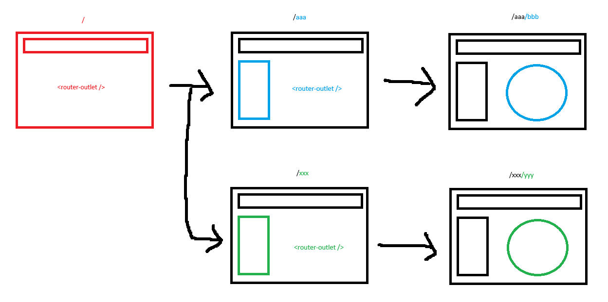
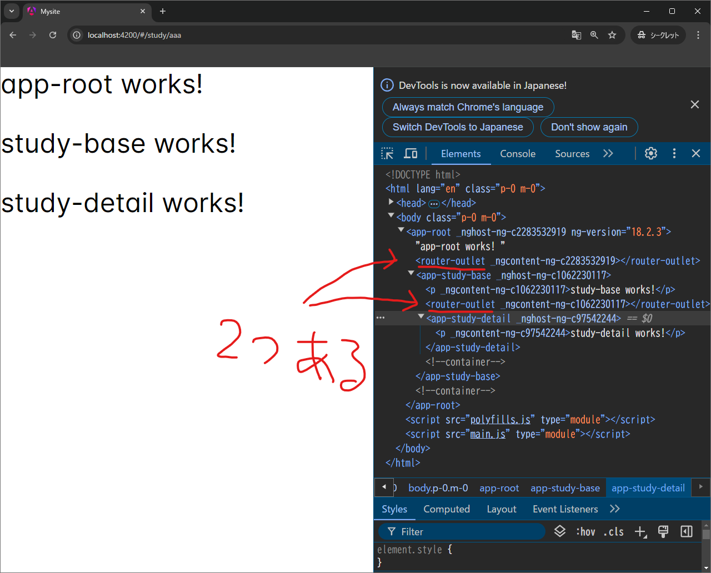

{"author":"magurouhiru","date":"2024/9/14","tags":[]}
# Angular でrouter-outlet を複数使う

## やったこと
Angular でRoute の設定をいじりrouter-outlet を複数使うことで深いネスト構造にした。  
イメージとしては↓みたいな感じ。  


## なんでやったの
ページごとに全く雰囲気が違うサイトをつくりたかったから。  
というのが半分。  
もう半分はやりたかったからです！  

## 具体的にどうするの？
言葉だけだと難しかったので、実際にやった作業ベースで説明します。  

まずコンポを3つ用意します。  
- StudyBaseComponent  
  - `<router-outlet />`付きのヘッダーとか書くとこ  
- StudyListComponent  
- StudyDetailComponent  
  - コンテンツ部分  

続いて、study-config.ts とstudy-routes.ts を用意します。
study-config.ts はprovider を記載する箇所です。  
空なので割愛。  

study-routes.ts は以下の通りです。  
```
import { Route } from '@angular/router';

import { StudyDetailComponent } from './children/study-detail.component';
import { StudyListComponent } from './children/study-list.component';
import { StudyBaseComponent } from './study-base.component';
import { StudyConfig } from './study-config';

export const studyRoutes: Route = {
  path: 'study',
  component: StudyBaseComponent,        ←ポイント！
  ...StudyConfig,
  children: [
    {
      path: '',
      component: StudyListComponent,
    },
    {
      path: ':studyId',
      component: StudyDetailComponent,
    },
  ],
};
```

ポイントは`<router-outlet />`を付けたコンポを登録したとこに、children も一緒に付けることです。  
こうすることで、`<router-outlet />`が動作します。  

最後にapp.routes.ts に登録します。
```
import { Routes } from '@angular/router';

import { articleRoutes } from './article/article-routes';
import { HomeComponent } from './home/home.component';
import { studyRoutes } from './study/study-routes';

export const routes: Routes = [
  {
    path: '',
    component: HomeComponent,
  },
  articleRoutes,
  studyRoutes,          ←ここ！
];
```

実行した結果がこちらです。


ちゃんと`<router-outlet />`が2つ動いていることが確認できました。  

手探りでやっていたので、うまくいった時は本当に嬉しかったです。  
あと、やっているうちに気付いたのですが、これってmain.ts と似ていることしていますね。  
いままでおまじないくらいの認識だったのが、少し意味が分かった気がします。  


今回の記事は以上です。  

前回記事はこちら  

https://qiita.com/magurouhiru/items/a713445660969c2365a8

詳細見たい人はこちら  

https://github.com/magurouhiru/mysite/pull/24

https://magurouhiru.github.io/mysite/
