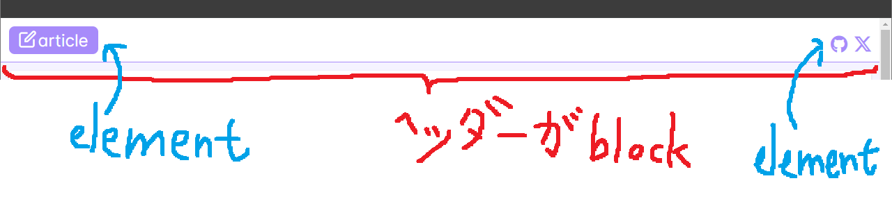

{"author":"magurouhiru","date":"2024/9/14","tags":["CSS","MindBEMding"]}
# MindBEMding を学んで使うまで

## やったこと
MindBEMding を勉強して、自作サイトに適用した。

## なんでやったの
やりたかったからです！  

## MindBEMding ってなに？
↓のサイト見て勉強しました。  

https://gist.github.com/juno/6182957

https://qiita.com/masaki632d/items/0e6eb00e9d8611c4d8b7

理解した内容としては以下の通り、
- 目的はだれが見てもすぐに理解できるクラス名にすること
- block, element, modifier の要素で命名する
- block は親
- element は子孫
- modifier は状態を表す。

なんとなく分かったような気がするが、ふわふわもしている。  
特にmodifier の使い方がびみょい。  
まあ使って見たらわかることもあるだろうと手を動かしてみる。  

## 実際に適用する
今回は自作サイトのヘッダーに適用します。  
（というかサボっていてそれ以外適用できる箇所がない。）  
作業前のソースは...汚すぎるので、リンクだけおいときます。  

https://github.com/magurouhiru/mysite/blob/dfcd5ea26d4e533ab169246cc9b51877c1411538/src/app/article/article-base.component.html

作業後のcss はちょっと長いのでリンクを貼っときます。  

https://github.com/magurouhiru/mysite/blob/03f9b95274ccabcdf56c456ffb83cbdc83282b36/src/app/article/article-base.component.scss

html はこちらです。
```
  <header class="header header--article">
    <nav class="header__nav">
      <a class="header__a" [routerLink]="'/article'">
        <div class="header__home header__home--article">
          <span
            class="pi pi-pen-to-square header__icon header__icon--home"
          ></span>
          <span>article</span>
        </div>
      </a>
      <div class="header__icons">
        <a href="https://github.com/magurouhiru/mysite">
          <div class="pi pi-github header__icon header__icon--article"></div>
        </a>
        <a href="https://twitter.com/magurouhiru7">
          <div class="pi pi-twitter header__icon header__icon--article"></div>
        </a>
      </div>
    </nav>
  </header>
```

切り分けはヘッダーがblock でそれ以外がelement としました。  
また、以下はmodifier に切り出しました。  
- `--article`色関係(今後色とか変えて使いまわす予定があるので)
- `--home`左のアイコンと`article`との間のちょっとした隙間(右のアイコンには不要)

## 感想
前のコードが汚いからすごい大変でした。  
ただ、クラス名を考える中で自然と整理され、(前と比べて)シンプルな構造にできました。  
私のような初級者にはそういう意味でも有効な気がしました。  

今回の記事は以上です。  

前回記事はこちら  

https://qiita.com/magurouhiru/items/300a8641b28a419eab98

詳細見たい人はこちら  

https://github.com/magurouhiru/mysite/pull/30

https://magurouhiru.github.io/mysite/
