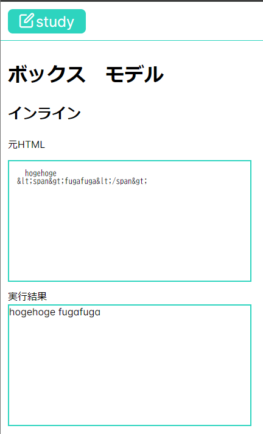
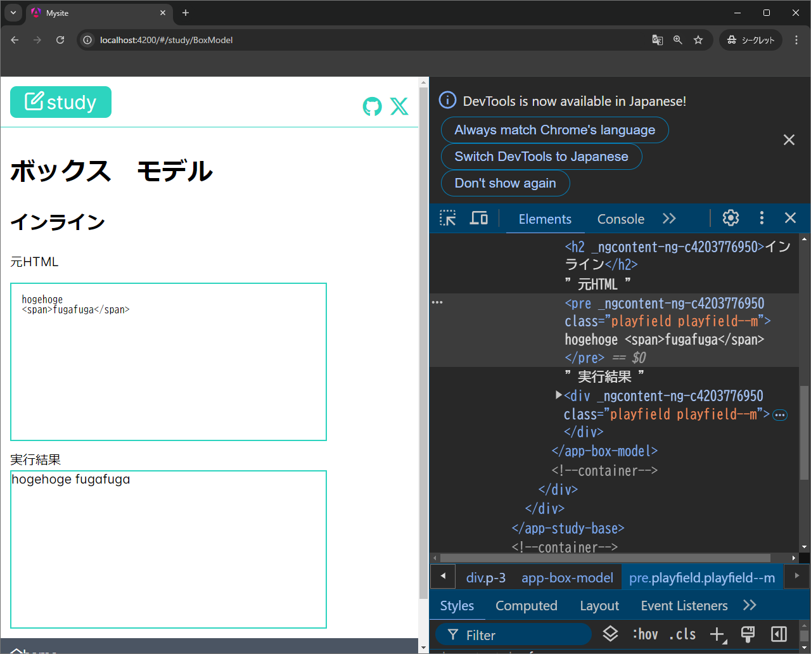

{"author":"magurouhiru","date":"2024/9/15","tags":["CSS","Angular"]}
# HTML とCSS の振る舞いを確認できるページを自作サイトで公開するまで

## やったこと
mdn 先生の↓みたいなボタン押したらCSS が切り替わるやつを作った。  

https://developer.mozilla.org/ja/docs/Web/CSS/line-height

## 前提
- 自作サイトはAngular でできている。
- ページの枠は作成済み。
- 詳しくは前々回記事参照

https://qiita.com/magurouhiru/items/300a8641b28a419eab98

## 本編
さっくり`ng g component`で作成したコンポを`Route`に登録する。  
で、早速迷った。  
どうやってHTML のタグとかそのまま表示するのだろう？  

最初は`<code>`タグ使えばいいのかなあと思っていたらダメだった。  
調べたら`<`は`&lt;`に`>`は`&gt;`に置き換えたらいけるらしい。

https://naruweb.com/coding/htmltag/

pipe とか作りたっかったけど、HTML テンプレートだと複数行の文字列がダメだった。  
なので、おとなしくコンポ内で文字列を定義して、関数で置き換えるやり方にする。  
と思って関数作って表示させたものがこちら。  

あれ？思ってたのと違う...  
置換せずに表示させたら期待通りに表示された  

### ちょっと脱線
↑で置換させずに済む理由が分かるようなわからないような。  
なので調べてみたら書き記事を見つけました。  

https://atmarkit.itmedia.co.jp/ait/articles/1702/13/news127.html

曰く、Angular ではデフォルトでサニタイズされる。  
そのため、HTML として表示させたい場合は適当なタグに`[innerHTML]="表示させたい文字列"`を追加させればよい。  
とのこと。  

確かに、API 通じて取ってきた文字列表示させようとしたら、なんかスクリプトが動いた！  
なんてなったら大変ですね。  
Angular はデフォルトでセキュア！みたいな記事をどっかで見ましたが、こういうところでしょうか。  

### 話を戻して
これで元のHTML を表示させることはできるようになりました。  
次はCSS を動的に変える仕組みが必要です。  

参考サイトは以下の通り。

https://blog.officekoma.co.jp/2019/08/classangular.html

https://qiita.com/gongon143/items/b7ec50cf6417110c1879

いくつか方法があるようですね。  
- ngStyle: コンポ内で定義したスタイルを適応する感じ。
- style binding: コンポ内で定義したスタイルを適応する感じ。
- ngIf: 要素ごと入れ替える感じ。
- `[class.xxxxx]`: `true` を入れたらそのクラスが適用される感じ。
- `[ngClass]`: ↑が連想配列形式になった感じ。
- `[class]`: 適用したいクラス名を入れる感じ。class と一緒には使えない。

まずは`[class.xxxxx]`を使おうかなと考えました。  
私の思いとしては、CSS で定義したクラスを変更する動きにしたい。  
デフォルトのスタイルを充てるためにclass と一緒に使いたいの2点です。  
なので、残りは↑と`[ngClass]`になります。  
ただ、`[ngClass]`は変えたいクラスが複数ある時に横に長くなってしまいそうと思いました。  
したがって↑の考えになったということです。  

やってみて気づきましたが、`[class.xxxxx]`はエディタの補完が聞きました。  
とても助かる。  
と思いましたが、ボタンとか大量に作るので、結局CSS からスニペットを出力する関数作りました。  

そしてなんやかんやで完成。  
成果物のリンクはこちら。  

https://magurouhiru.github.io/mysite/#/study/BoxModel

## 感想
楽しかったです。  
あと、自作サイトがだんだん大きくなってきた感じがしてうれしいです。  

今回の記事は以上です。  

前回記事はこちら  

https://qiita.com/magurouhiru/items/acce141010141ac37098

詳細見たい人はこちら  

https://github.com/magurouhiru/mysite/pull/32

https://magurouhiru.github.io/mysite/
