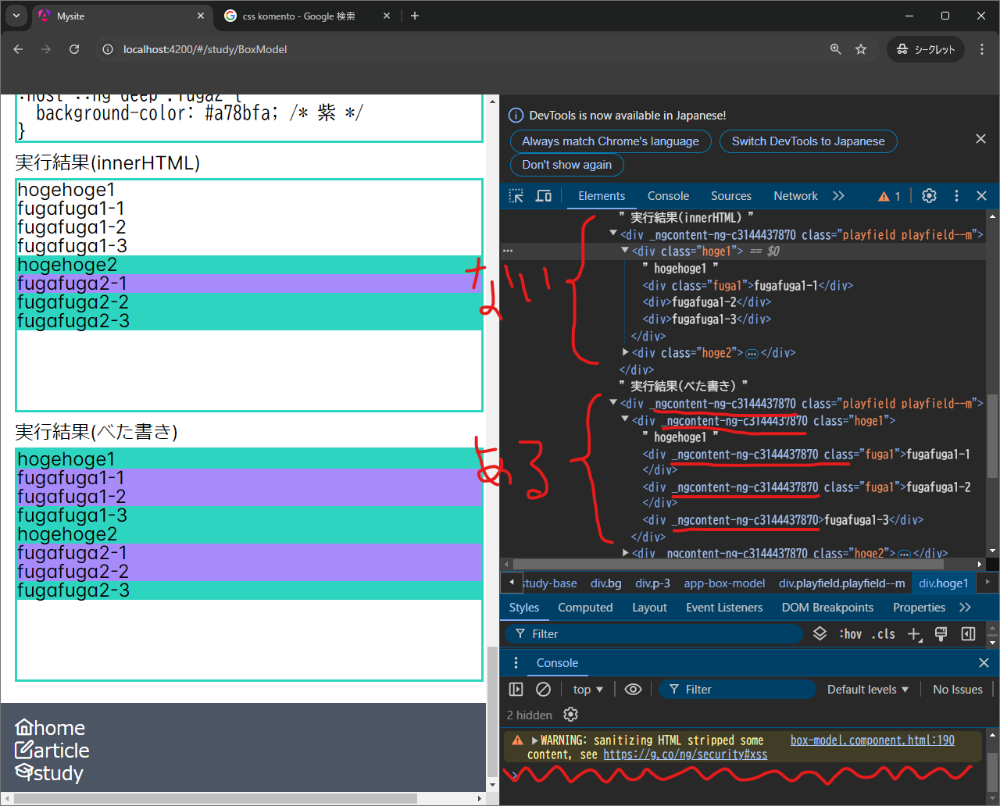
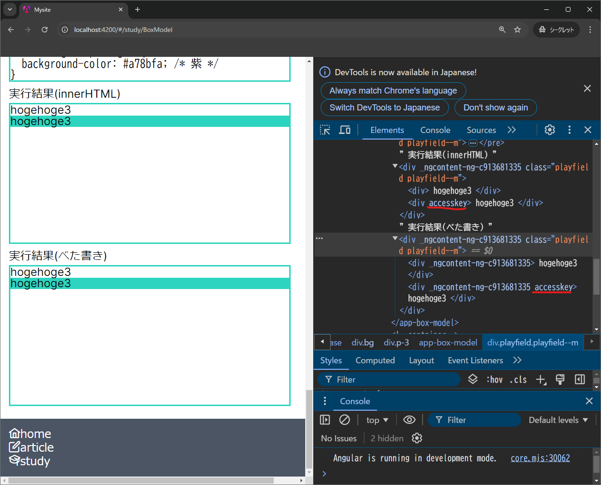

{"author":"magurouhiru","date":"2024/9/15","tags":["Angular","CSS"]}
# Angular のスタイルカプセル化とinnerHTML のサニタイズについて少し理解を深めるまで

## 前置き
Angular でinnerHTML を使っていたら、スタイルカプセル化とサニタイズについて少し理解を深められたのでそのメモ  
なんでinnerHTML を使ってたかは前回記事参照

https://qiita.com/magurouhiru/items/c7c43fe37ed859173eae

## 本編
先に結果から。

### Angular スタイルカプセル化について
↓が参考記事。

https://atmarkit.itmedia.co.jp/ait/articles/1712/18/news141.html

一言でいうと、カプセル化はCSS の属性セレクターを使って実現している。  

順序だてていうと↓の通り。
- コンポごとにid※が割り当てられる。
  - 例：`_ngcontent-ng-c1513204815`
- コンポ配下のHTML要素に対して、idを属性として埋め込む。
  - 例：`<div>...</div>` → `<div _ngcontent-ng-c1513204815>...</div>`
- コンポ配下のCSS要素のセレクタに対して、
  - 通常の場合：属性セレクタをつなげる。
    - 例：`.hoge {...}` → `.hoge[_ngcontent-ng-c1513204815] {...}`
  - `:host ::ng-deep`の場合：属性セレクタを頭から半角スペース付きでつなげる。
    - 例：`.hoge {...}` → `[_ngcontent-ng-c1513204815] .hoge {...}`
  - `::ng-deep`の場合：属性セレクタを付与しない。

したがって、通常は属性が異なるため、異なるコンポのスタイルが適用されることはない。  
(こんなこと書いている本人は属性セレクタの存在を知らなかった。)

※ビルド後のファイルには一致する箇所が見つからなかった。  
　また、ビルド毎に変わったり変わらなかったりして不思議。  

### innerHTML のサニタイズについて
`SanitizingHtmlSerializer`で実行している。
サニタイズされるケースは以下の3種類。
- nodeType がelement またはtext 以外の場合。
  - 具体的にどういうものかちょっと想像つかないけど...
- nodeType がelement の場合かつ、タグ名がホワイトリストにない場合。
  - ホワイトリストは`VALID_ELEMENTS`で定義されている。
- nodeType がelement の場合かつ、属性名がホワイトリストにない場合。
  - ホワイトリストは`VALID_ATTRS`で定義されている。

↑で引っかかった場合ははじかれ、警告が表示される。


## おまけ(記事的にはおまけだけど本来こっちがやりたかったこと)
↑を調べるに至った流れとそれを踏まえてやったことをだらだら書きます。

前回記事から引き続き、mdn 先生の↓みたいなボタン押したらCSS が切り替わるやつを作っていた。  

https://developer.mozilla.org/ja/docs/Web/CSS/line-height

https://qiita.com/magurouhiru/items/c7c43fe37ed859173eae

その中で疑問に思ったことがあった。  
内容は`[innerHTML]="表示させたい文字列"`で埋め込んだ要素にクラスは適用できるのか？動的に変更できるのか？です。  

結果がこちら。  
html
```
<div class="hoge1">
  hogehoge1
  <div class="fuga1">fugafuga1-1</div>
  <div [class.fuga1]="true">fugafuga1-2</div>
  <div [class.fuga1]="false">fugafuga1-3</div>
</div>
<div class="hoge2">
  hogehoge2
  <div class="fuga2">fugafuga2-1</div>
  <div [class.fuga2]="true">fugafuga2-2</div>
  <div [class.fuga2]="false">fugafuga2-3</div>
</div>
```
css
```
.hoge1 {
  background-color: #2dd4bf; /* 緑 */
}
.fuga1 {
  background-color: #a78bfa; /* 紫 */
}

:host ::ng-deep .hoge2 {
  background-color: #2dd4bf; /* 緑 */
}
:host ::ng-deep .fuga2 {
  background-color: #a78bfa; /* 紫 */
}
```


箇条書きすると、  
- innerHTML でもクラスは適用できる。  
  - ただし、~~別モジュール扱いなので~~コンポの属性がないので、style.css か`:host ::ng-deep`をつけて書く必要がある。※注意：`::ng-deep`は非推奨    
- `_ngcontent-ng-c~`がinnerHTML だとついていない。  
- `[class.xxxxx]`は使えない。  
  - 警告も出る。

サニタイザー先生に怒られるのはちょっと嫌なので、動的にクラスを変えるときはinnerHTML を使わないようにしよう。  
`::ng-deep`はAngular のスタイルカプセル化を壊すだけ、  
つまり、開発者が変なスタイルが適用されてる！なんで？となるかもしれないよ  
という話なので使う。`:host`付けてるから子にしか影響ないし。  

ところで、なんかついてる`_ngcontent-ng-c~`って何だろう？
あと、サニタイザー先生の逆鱗はどこなんだろう？

で調べた結果が本編です。  

そして本編を踏まえてもう一度実験した結果がこちら。  
html
```
<div>
  hogehoge3
</div>
<div accesskey>
  hogehoge3
</div>
```
css
```
:host ::ng-deep [accesskey] {
  background-color: #2dd4bf; /* 緑 */
}
```


うまくいきました！  
ここには載せないけど、`accesskey`を消すボタン作って動かしたら背景色も消えました！  
これでinnerHTML を使っても動的にスタイルを変える手段が分かりました！  
やらないけど。  

## 感想
楽しかった。  
属性セレクタとかサニタイズの仕組みとか分からないことが分かってうれしい。
あと、結構見逃しているとこがあるなと思いました。  
HTML 要素の属性なんて、あんな長いのに気が付かなかった...  


今回の記事は以上です。  

前回記事はこちら  

https://qiita.com/magurouhiru/items/c7c43fe37ed859173eae
